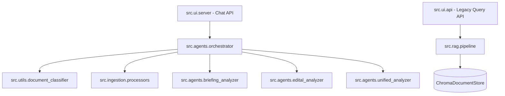

# Codebase Technical Specification: Marketing Agent RAG & Analysis System

This document provides a compressed, high-impact overview of the Marketing Agent codebase, optimized for LLM context window efficiency.

## 1. System Overview
A modular AI system for marketing campaign analysis and retrieval. It features two primary workflows:
1.  **RAG (Retrieval-Augmented Generation)**: Querying a historical database of campaign documents using Haystack and ChromaDB.
2.  **Automated Analysis**: Classifying and summarizing new briefing/edital documents using specialized agents.

## 2. Architecture & Module Relationships

## 3. Directory Structure & Key Files
- `src/agents/`: Core logic for document analysis.
    - `orchestrator.py`: Main entry point for document processing; handles classification and routing.
    - `briefing_analyzer.py` / `edital_analyzer.py`: specialized LLM pipelines for specific document types.
    - `unified_analyzer.py`: Batch analysis for multiple documents.
- `src/rag/`: Haystack-based retrieval logic.
    - `pipeline.py`: Defines the `RAGPipeline` (Embedder -> Retriever -> Prompt -> LLM).
- `src/ui/`: FastAPI interfaces.
    - `server.py`: Primary OpenAI-compatible API (port 8000). Supports attachments.
    - `api.py`: Secondary RAG query-only API (port 8001).
- `src/ingestion/`: Recursive data extraction and chunking.
    - `processors.py`: Text extraction from PDF/DOCX and chunking logic.
    - `run.py`: Recursive directory walker that maps files to clients based on folder structure.
- `src/utils/`: Shared utilities (logging, classification).

## 4. Technical Stack & Dependencies
- **LLM Orchestration**: Haystack AI (Pipeline, Components).
- **Web Framework**: FastAPI.
- **Vector Database**: ChromaDB (via `chroma-haystack`).
- **Embeddings**: `BAAI/bge-m3` (SentenceTransformers).
- **Document Parsing**: `pypdf`, `python-docx`.

## 5. API Contracts (Critical)

### `src.ui.server` (Primary - OpenAI Compatible)
- **Endpoint**: `POST /v1/chat/completions`
- **Models**:
    - `marketing-rag-agent`: Standard RAG flow.
    - `gpt-4o-mini-analyzer`: Sequential document analysis.
    - `unified-analyzer-agent`: Batch analysis for multiple documents.
- **Features**: Detects `<source>` tags or attachment IDs in the request body to trigger analysis.

### `src.ui.api` (Legacy/Internal)
- **Endpoint**: `POST /query`
- **Payload**: `{"question": "string"}`
- **Response**: `{"answer": "string", "sources": []}`

## 6. Key Abstractions & Patterns
- **Orchestration Pattern**: `DocumentOrchestrator` centralizes the logic for classification, extraction, and delegation to specific analyzers.
- **Lazy Loading**: `server.py` uses an `AppState` class for lazy initialization of RAG and Orchestrator components.
- **Automatic Classification**: Files are classified as `briefing` or `edital` based on filename patterns (`src.utils.document_classifier`).

## 7. Configuration & Environment
Essential `.env` variables:
- `OPENAI_API_KEY`: Required for LLM generation.
- `REPERTORIO_FOLDER`: Path for bulk ingestion (default: `data/fichas_de_repertorio`). Supports recursive subdirectories (first level used as `client` name).
- `VECTOR_STORE_PATH`: Path to ChromaDB persistence (default: `vectorstore/`).
- `API_PORT`: Server port (default: 8000).
- `OPEN_WEBUI_URL` & `OPEN_WEBUI_API_KEY`: Required for fetching attachments from Open WebUI.

## 8. Development Constraints & Invariants
- **Language**: All analysis outputs (summaries) must be in **Portuguese-BR**.
- **Extraction**: Only PDF and DOCX are supported for text extraction.
- **Port Conflict**: `server.py` (8000) and `api.py` (8001) must run on different ports if used simultaneously.
- **Data Persistence**: ChromaDB uses a collection named `documents`.

## 9. Potential Refactoring Targets
- **LLM Provider Hardcoding**: `RAGPipeline` is currently hardcoded to `gpt-3.5-turbo` in some parts; should be parameterizable.
- **Duplicate Logic**: Text extraction logic is partially duplicated between `processors.py` and analyzer scripts.
- **Test Coverage**: Focus on `src.agents` and `src.rag` unit tests is needed; current tests are minimal.
