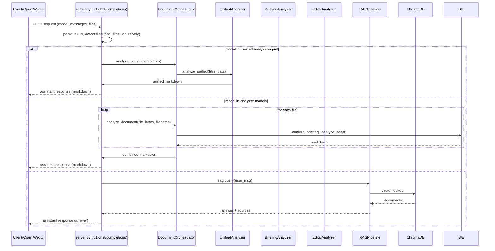

Executive summary
-----------------
This document explains how the three primary API models — `marketing-rag-agent`, `gpt-4o-mini-analyzer`, and `unified-analyzer-agent` — are orchestrated in the project. It documents responsibilities, execution sequence, payload formats, decision logic, error handling, state considerations, performance trade-offs, and maps statements back to concrete code locations for rapid developer action.

Component roles
---------------
- marketing-rag-agent: retrieval-augmented generation for user queries using `src/rag/pipeline.py`.
- gpt-4o-mini-analyzer: sequential per-file analysis using `src/agents/briefing_analyzer.py` and `src/agents/edital_analyzer.py` orchestrated by `src/agents/orchestrator.py`.
- unified-analyzer-agent: batch, single-call analysis of multiple documents implemented in `src/agents/unified_analyzer.py`.

Sequence of execution (high level)
---------------------------------
1. Client posts to the OpenAI-compatible endpoint: [`/v1/chat/completions`](src/ui/server.py:203).
2. `server.py` parses the body, detects `model` and searches for attached files (recursive search and `<source>` tags) — see [`src/ui/server.py:225-263`](src/ui/server.py:225).
3. If files exist and the model is an analyzer (`gpt-4o-mini-analyzer` or `unified-analyzer-agent`), attachments are fetched (via Open WebUI or virtual content) and passed to the `DocumentOrchestrator` (`src/agents/orchestrator.py:14-19`).
4. `DocumentOrchestrator` classifies filenames with `classify_filename()` (`src/utils/document_classifier.py:9-25`) and dispatches to `BriefingAnalyzer`, `EditalAnalyzer`, or `UnifiedAnalyzer`.
5. Analyzers run Haystack Pipelines with PromptBuilder + LLM components (see `src/agents/briefing_analyzer.py:87-95`, `src/agents/edital_analyzer.py:79-87`, `src/agents/unified_analyzer.py:80-88`).
6. Analyzer outputs are concatenated by `server.py` and returned in an OpenAI-compatible response (see response building at `src/ui/server.py:350-367`).

Mermaid sequence diagram
------------------------


Context & payload formats
-------------------------
1. Client request (simplified):

```json
{
  "model": "gpt-4o-mini-analyzer",
  "messages": [
    {"role": "system", "content": "..."},
    {"role": "user", "content": "Please analyze attached files."}
  ],
  "files": [
    {"id": "1", "name": "Briefing_ClientA.pdf"}
  ]
}
```

Relevant keys and how they are used:
- model: selects RAG vs analyzer path (`src/ui/server.py:216-218`).
- messages: conversational context; server extracts last user message for RAG (`src/ui/server.py:388-392`).
- files/attachments: discovered by `find_files_recursively()` (`src/ui/server.py:177-201`) and fetched via `fetch_file_from_webui()` (`src/ui/server.py:93-110`).

Analyzer-internal payload handed to Haystack PromptBuilder (example in UnifiedAnalyzer):

```json
{
  "prompt_builder": {"content": "--- DOCUMENTO 1: Briefing_ClientA.pdf (Tipo: BRIEFING) ---\n<file content>"}
}
```

Decision logic (pseudocode)
---------------------------
```
body = parse_json(request)
model = body.get("model", "marketing-rag-agent")
files = find_files_recursively(body)

if files:
    if model == "unified-analyzer-agent":
        result = orchestrator.analyze_unified(batch_files)
    else:  # sequential analyzer
        for f in files:
            result = orchestrator.analyze_document(...)
else:
    # RAG flow
    user_msg = extract_last_user_message(messages)
    answer = rag.query(user_msg)

return openai_compatible_response(answer_or_markdown)
```

Error and edge-case handling
----------------------------
- Missing files: analyzer models return a user-facing error message (`src/ui/server.py:370-385`).
- Non-compliant filename classification: `classify_filename()` returns `invalid` and orchestrator returns a warning (`src/agents/orchestrator.py:31-37`, `src/agents/orchestrator.py:90-98`).
- Extraction failures: orchestrator logs extraction errors and skips files in unified batch (`src/agents/orchestrator.py:82-88`, `src/agents/orchestrator.py:105-108`).
- LLM/timeout errors: pipelines configured with timeouts and exceptions return `None` or raise, handled by orchestrator and server to surface a failure message (`src/agents/unified_analyzer.py:84-87`, `src/agents/briefing_analyzer.py:91-95`).

State and session management (current behavior)
--------------------------------------------
- The system is stateless per-request. `AppState` holds singleton pipeline instances but NOT conversation/session state (`src/ui/server.py:67-72`).
- RAG receives only the last user message (`src/ui/server.py:388-392`) and has no built-in awareness of previous analyzer outputs, causing context loss after analyzer execution.

Performance & latency considerations
-----------------------------------
- Sequential analyzer (`gpt-4o-mini-analyzer`): LLM call per file. Latency grows linearly with file count (timeouts set to 120s per file in analyzers: [`src/agents/briefing_analyzer.py:91-95`]).
- Unified analyzer: single LLM call for combined content; potentially faster for many files but riskier in token limits and single-point failures; timeout set to 180s (`src/agents/unified_analyzer.py:84-87`).
- RAG: latency depends on embedder + retriever; Chroma lookups are fast, but downstream LLM call adds latency (`src/rag/pipeline.py:44-56`).

Mapping back to code (selected references)
-----------------------------------------
- Request endpoint and model routing: [`src/ui/server.py:203-218`](src/ui/server.py:203).
- File discovery: [`src/ui/server.py:156-201`, `src/ui/server.py:242-263`](src/ui/server.py:156).
- Orchestrator: [`src/agents/orchestrator.py:14-22`, `src/agents/orchestrator.py:69-76`](src/agents/orchestrator.py:14).
- Classification: [`src/utils/document_classifier.py:9-25`](src/utils/document_classifier.py:9).
- Per-file analyzers: [`src/agents/briefing_analyzer.py:27-95`](src/agents/briefing_analyzer.py:27), [`src/agents/edital_analyzer.py:27-87`](src/agents/edital_analyzer.py:27).
- Unified analyzer pipeline: [`src/agents/unified_analyzer.py:80-88`, `src/agents/unified_analyzer.py:114-121`](src/agents/unified_analyzer.py:80).
- RAG pipeline and template: [`src/rag/pipeline.py:24-56`](src/rag/pipeline.py:24).

Recommended tests & verification steps
--------------------------------------
1. Integration test: POST unified analysis then immediately POST RAG query passing returned session identifier (see recommended session changes in technical gap doc). Expect RAG answer that references the unified analysis content.
2. Load test: sequential analyzer with N small documents to measure latency scaling.
3. Edge-case tests: invalid filename, unsupported file type, partially failed extraction in batch.

End of file

