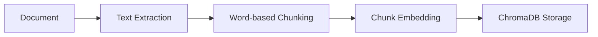
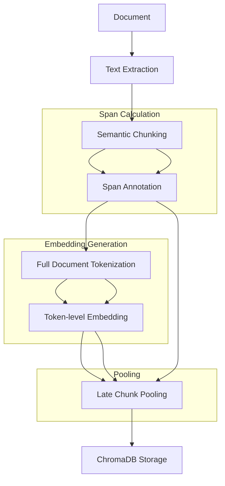
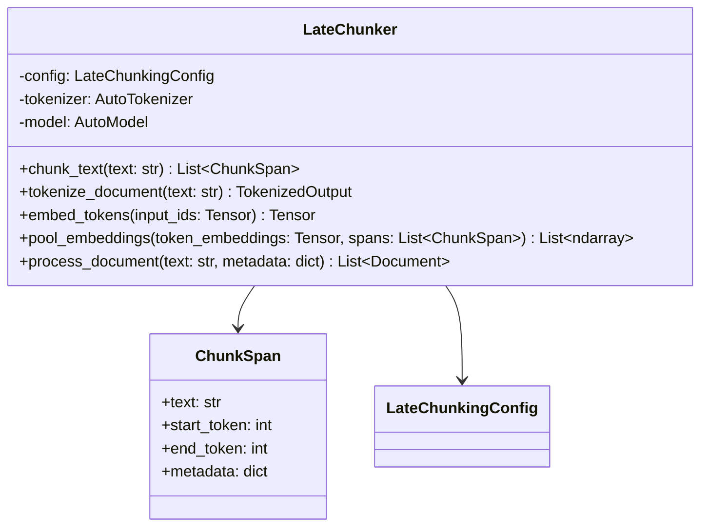
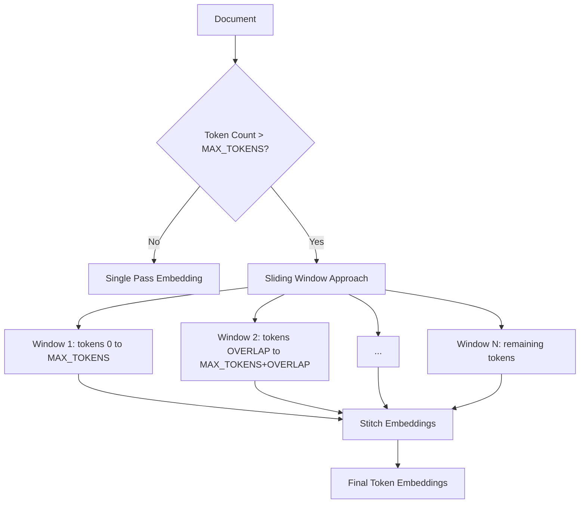

# Late Chunking Implementation Plan

## Executive Summary

This document outlines the implementation plan for upgrading the repository's embedding strategy from a naive "chunk-then-embed" approach to "Late Chunking" to maximize context retention and retrieval accuracy.

## Current Architecture Analysis

### Existing Embedding Flow



**Current Issues:**
1. **Context Loss**: Each chunk is embedded independently, losing cross-chunk context
2. **Boundary Problems**: Semantic meaning can be split across chunk boundaries
3. **No Token Awareness**: Chunking is word-based, not token-aware

### Key Files to Modify

| File | Purpose | Changes Required |
|------|---------|------------------|
| [`src/ingestion/processors.py`](src/ingestion/processors.py) | Document chunking | Integrate LateChunker |
| [`src/indexing/pipeline.py`](src/indexing/pipeline.py) | Embedding pipeline | Support late chunking workflow |
| [`src/config/__init__.py`](src/config/__init__.py) | Configuration | Add new config settings |
| [`src/vector_store/chroma_store.py`](src/vector_store/chroma_store.py) | Vector storage | Verify compatibility |

## Proposed Architecture

### Late Chunking Flow



### Algorithm Overview

1. **Chunk Boundary Discovery**: Split text into semantic chunks and compute span annotations mapping each chunk to token index ranges
2. **Full-Document Token Embeddings**: Tokenize entire document once and generate token-level embeddings with context window handling
3. **Late Chunking Pooling**: For each chunk span, slice token embeddings and apply mean-pooling

## Implementation Details

### Phase 1: Configuration Module

**File**: `src/config/__init__.py`

```python
from dataclasses import dataclass
from typing import Literal

@dataclass
class LateChunkingConfig:
    MAX_TOKENS: int = 8192  # Context window limit
    CHUNK_METHOD: Literal["sentence", "paragraph", "semantic"] = "sentence"
    POOLING_STRATEGY: Literal["mean", "max", "weighted_mean"] = "mean"
    OVERLAP_TOKENS: int = 50  # Token overlap for sliding window
    EMBEDDING_MODEL: str = "BAAI/bge-m3"
```

### Phase 2: Late Chunker Module

**File**: `src/indexing/late_chunker.py`



**Key Methods:**

1. `chunk_text(text: str) -> List[ChunkSpan]`
   - Splits text into semantic chunks using NLTK sentence tokenizer or custom logic
   - Maps each chunk to character offsets in original text
   - Converts character offsets to token spans after tokenization

2. `tokenize_document(text: str) -> TokenizedOutput`
   - Tokenizes entire document at once
   - Handles context window limits via truncation or sliding windows
   - Returns input_ids and attention_mask

3. `embed_tokens(input_ids: Tensor) -> Tensor`
   - Generates token-level embeddings using the model
   - Returns hidden states for all tokens

4. `pool_embeddings(token_embeddings: Tensor, spans: List[ChunkSpan]) -> List[ndarray]`
   - Slices token embeddings according to span boundaries
   - Applies configured pooling strategy (mean, max, weighted_mean)
   - Returns one vector per chunk

### Phase 3: Context Window Handling

**Strategy for Long Documents:**



**Implementation Approach:**
- Use sliding window with overlap to maintain context at boundaries
- Deduplicate overlapping token embeddings by averaging
- Log warnings when truncation occurs

### Phase 4: Integration with Existing Pipeline

**Modified Files:**

1. **`src/ingestion/processors.py`**
   - Add `LateChunkerProcessor` class that wraps `LateChunker`
   - Maintain backward compatibility with existing `DocumentProcessor`
   - Add factory method to select processor based on configuration

2. **`src/indexing/pipeline.py`**
   - Create `LateChunkingPipeline` class
   - Maintain existing `IndexingPipeline` for backward compatibility
   - Add configuration flag to select pipeline type

3. **`src/ingestion/run.py`**
   - Add environment variable `USE_LATE_CHUNKING=true/false`
   - Conditionally instantiate appropriate pipeline

### Phase 5: ChromaDB Compatibility

**Analysis:**
- ChromaDB stores pre-computed embeddings with documents
- Late chunking produces one embedding per chunk (same as current approach)
- **No migration needed** - ChromaDB is fully compatible

**Verification Points:**
- [ ] Embedding dimension consistency
- [ ] Metadata preservation
- [ ] Query compatibility with existing `ChromaEmbeddingRetriever`

## Backward Compatibility Strategy

### API Preservation

```python
# Existing API - preserved
class DocumentProcessor:
    def create_chunks(text: str, metadata: dict) -> List[Document]: ...

# New API - additive
class LateChunkerProcessor:
    def create_chunks(text: str, metadata: dict) -> List[Document]: ...
    
# Factory function
def get_processor(use_late_chunking: bool = False) -> Union[DocumentProcessor, LateChunkerProcessor]:
    ...
```

### Migration Layer

```python
# src/utils/migration.py
def migrate_existing_embeddings(store: ChromaAdapter, late_chunker: LateChunker):
    """Re-index existing documents with late chunking if needed."""
    ...
```

## Configuration Options

| Setting | Type | Default | Description |
|---------|------|---------|-------------|
| `USE_LATE_CHUNKING` | bool | false | Enable late chunking |
| `MAX_TOKENS` | int | 8192 | Context window limit |
| `CHUNK_METHOD` | str | "sentence" | Chunking method: sentence, paragraph, semantic |
| `POOLING_STRATEGY` | str | "mean" | Pooling strategy: mean, max, weighted_mean |
| `OVERLAP_TOKENS` | int | 50 | Token overlap for sliding window |
| `EMBEDDING_MODEL` | str | "BAAI/bge-m3" | Embedding model name |

## Test Strategy

### Unit Tests

1. **Chunk/Span Alignment Tests**
   - Verify chunk text matches span slice of original text
   - Verify token spans correctly map to chunks
   - Test edge cases: empty chunks, single-chunk documents

2. **Embedding Count Consistency**
   - Verify number of embeddings equals number of chunks
   - Verify embedding dimensions are consistent

3. **Determinism Tests**
   - Same input produces same output across runs
   - Verify no random state affects results

4. **Context Window Tests**
   - Test documents under MAX_TOKENS
   - Test documents over MAX_TOKENS (sliding window)
   - Verify overlap handling

### Integration Tests

1. **End-to-End Ingestion**
   - Process sample documents through full pipeline
   - Verify ChromaDB storage and retrieval

2. **Regression Tests**
   - Compare retrieval quality metrics before/after
   - Verify existing queries still work

## File Structure

```
src/
├── config/
│   └── __init__.py          # Add LateChunkingConfig
├── indexing/
│   ├── __init__.py
│   ├── pipeline.py          # Add LateChunkingPipeline
│   └── late_chunker.py      # NEW: LateChunker class
├── ingestion/
│   ├── processors.py        # Add LateChunkerProcessor
│   └── run.py               # Add config flag
└── utils/
    └── migration.py         # NEW: Migration utilities

docs/
└── late_chunking.md         # NEW: Documentation

tests/
├── test_late_chunker.py     # NEW: Unit tests
└── test_late_chunking_integration.py  # NEW: Integration tests
```

## Implementation Sequence

1. **Step 1**: Create configuration module with new settings
2. **Step 2**: Implement `LateChunker` class with core algorithm
3. **Step 3**: Add context window handling for long documents
4. **Step 4**: Create `LateChunkerProcessor` wrapper
5. **Step 5**: Create `LateChunkingPipeline` class
6. **Step 6**: Update `run.py` with configuration flag
7. **Step 7**: Write unit tests
8. **Step 8**: Write integration tests
9. **Step 9**: Create documentation
10. **Step 10**: Add migration utilities

## Risk Assessment

| Risk | Impact | Mitigation |
|------|--------|------------|
| Memory usage on large documents | High | Implement streaming/chunked processing |
| Breaking existing queries | Medium | Maintain backward compatibility layer |
| Performance degradation | Medium | Benchmark and optimize pooling |
| Model compatibility | Low | Use standard HuggingFace interfaces |

## Success Criteria

- [ ] All unit tests pass
- [ ] Integration tests demonstrate correct chunk/embedding alignment
- [ ] Existing ingestion/retrieval APIs remain functional
- [ ] Documentation is complete and accurate
- [ ] No regression in retrieval quality metrics
